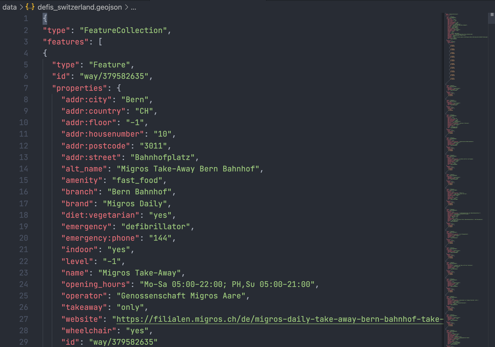

## Beschreibung der Datensammlung
Sammlung von Files (JSON und CSV) für die Defikarte.ch und deren Partner die in Zukunft Daten beziehen möchten.
Die Daten können hier bezogen werden: [`data` Verzeichnis](https://github.com/chnuessli/defi_archive/tree/main/data)

**Wichtig**
Die Daten sind direkt aus OSM exportiert und in GeoJSON abgefüllt, danach werden die Daten in CSV konvertiert.



## Sinn und Zweck

Sinn dieses Archivs ist es, Datenveränderungen täglich nachzuvollziehen. Stündlich wird nun automatisiert ein GeoJSON generiert und somit Datenveränderungen dokumentiert. Für weitere Verarbeitung stellen wir nun auch CSV Dateien zu Verfügung.
Die Datensammlung soll stetig wachsen und so ein sauberes Archiv generieren.

## Overpass Abfragen via Overpass API

Die Abfragen sind immer gleich aufgebaut, hier ein paar Beispiele. Für alle Abfragen besuche bitte die TXT Files. Die TXT Files dazu findet man in `queries`.

Umgebaute Queries die mit der Overpass API korrespondieren können, ein Auszug und nicht vollständig. Die untenstehenden Snippets sind als Beispiel zu betrachten.

<details><summary>Abfragen ausklappen</summary>
<p>

## Defibrillatoren

### Dispogebiet SRZ

```json
[out:json][timeout:25];
(
//Kanton Zürich
area["ISO3166-2"="CH-ZH"];
//Kanton Schwyz
area["ISO3166-2"="CH-SZ"];
//Kanton Schaffhausen
area["ISO3166-2"="CH-SH"];
//Kanton Zug
area["ISO3166-2"="CH-ZG"];
)->.searchArea;
// gather results
(
nwr["emergency"="defibrillator"](area.searchArea);
);
// print results
out body;
>;
out skel qt;
```

### Kanton ZH

```json
[out:json][timeout:25];
// fetch area “CH-ZH” to search in
area["ISO3166-2"="CH-ZH"]->.searchArea;
// gather results
(
  // query part for: “emergency=defibrillator”
  node["emergency"="defibrillator"](area.searchArea);
  way["emergency"="defibrillator"](area.searchArea);
  relation["emergency"="defibrillator"](area.searchArea);
);
// print results
out body;
>;
out skel qt;
```

### Stadt ZH

```json
[out:json][timeout:25];
area[name="Zürich"]["wikipedia"="de:Zürich"]->.zurich;
// gather results
(
  node["emergency"="defibrillator"](area.zurich);
  way["emergency"="defibrillator"](area.zurich);
  relation["emergency"="defibrillator"](area.zurich);
);
// print results
out body;
>;
out skel qt;
```

### Kanton SG

```json
[out:json][timeout:25];
(
//Kanton St. Gallen
area["ISO3166-2"="CH-SG"];
//Kanton Glarus
area["ISO3166-2"="CH-GL"];
//Kanton Appenzell Innerhoden
area["ISO3166-2"="CH-AI"];
//Kanton Appenzell Ausserhoden
area["ISO3166-2"="CH-AR"];
)->.searchArea;
// gather results
(
nwr["emergency"="defibrillator"](area.searchArea);
);
// print results
out body;
>;
out skel qt;
```

### KNZ St.Gallen

```json
[out:json][timeout:25];
(
//Kanton St. Gallen
area["ISO3166-2"="CH-SG"];
//Kanton Glarus
area["ISO3166-2"="CH-GL"];
//Kanton Appenzell Innerhoden
area["ISO3166-2"="CH-AI"];
//Kanton Appenzell Ausserhoden
area["ISO3166-2"="CH-AR"];
)->.searchArea;
// gather results
(
nwr["emergency"="defibrillator"](area.searchArea);
);
// print results
out body;
>;
out skel qt;
```

### Defikarte.ch 24h Defis

Dieses JSON wird für die Webseite Defikarte.ch benötigt.

```json
[out:json][timeout:25];
(
//ganze Schweiz 24h Defis
area["ISO3166-1"="CH"];
)->.searchArea;
// gather results
(
nwr["emergency"="defibrillator"]["opening_hours"="24/7"](area.searchArea);
);
// print results
out body;
>;
out skel qt;
```

### Defikarte.ch NICHT 24h Defis

Dieses JSON wird für die Webseite Defikarte.ch benötigt.

```json
[out:json][timeout:25];
(
//ganze Schweiz
area["ISO3166-1"="CH"];
)->.searchArea;
// gather results
(
nwr["emergency"="defibrillator"]["opening_hours"!="24/7"](area.searchArea);
);
// print results
out body;
>;
out skel qt;
```

</p>
</details>

## Automation

In diesem Repository sind GitHub Actions eingerichtet, um täglich aktuelle Daten via [Overpass API](https://wiki.openstreetmap.org/wiki/Overpass_API) abzufragen und als GeoJSON abzulegen.

* Die aktuelle GeoJSON-Dateien sind im [`data` Verzeichnis](https://github.com/Schutz-Rettung-Zurich/json-archive/tree/main/data)
* Die GitHub Actions sind im [`overpass.yml`](https://github.com/Schutz-Rettung-Zurich/json-archive/blob/main/.github/workflows/overpass.yml) Workflow beschrieben
* Der Workflow verwendet das Skript [`run_queries.sh`](https://github.com/Schutz-Rettung-Zurich/json-archive/blob/main/run_queries.sh) um alle Queries laufen zu lassen
* Jedes Overpass-Query ist in einer eigenen Datei im [Verzeichnis `queries`](https://github.com/Schutz-Rettung-Zurich/json-archive/tree/main/queries) abgelegt

### Neues Query hinzufügen

Um ein neues Query hinzuzufügen, müssen folgende Schritte befolgt werden:

1. Query schreiben und via http://overpass-turbo.osm.ch/ testen. **ACHTUNG:** es ist nur die Overpass Query Syntax unterstützt, **keine [Overpass Turbo Shortcuts](https://wiki.openstreetmap.org/wiki/Overpass_turbo/Extended_Overpass_Turbo_Queries)** (z.B. ` {{geocodeArea:CH-ZH}}`)
2. Query als neue Datei in [`queries` Verzeichnis](https://github.com/Schutz-Rettung-Zurich/json-archive/tree/main/queries) ablegen
3. Neues Query in [`run_queries.sh`](https://github.com/Schutz-Rettung-Zurich/json-archive/blob/main/run_queries.sh) aufrufen

### Konvertierung der Daten

Um die Daten in CSV zu konvertieren wurde ein neuer Workflow eingerichtet.

1. In der Datei `converter.py` die Input Datei (GeoJSON) und die Output Datei (CSV) in eine neue Zeile schreiben.
2. Den Workflow `convert.yml`laufen lassen


## Reporting: Änderungen an Defi-Daten per E-Mail

Dieses Repository enthält einen automatisierten Reporting-Mechanismus, der Änderungen an den Defi-Daten pro Kanton/Region überwacht und als HTML-Mail verschickt.

### Architektur

```
kantone_config.json          ← einzige Konfigurationsquelle (Kantone, Secrets, Modus)
generate_workflows.py        ← generiert die Workflow-YMLs daraus
scripts/
  process_all_kantone.py     ← Kernlogik: läuft bei JEDEM Overpass-Run
  geojson_diff.py            ← Diff-Rendering für "immediate"-Kantone
  geojson_diff_be.py         ← Diff-Rendering für BE (sofort + pending)
  build_weekly_report.py     ← Rendering für den wöchentlichen BE-Report
.github/workflows/
  geojson-reporting-all.yml       ← DER EINE Workflow für alle Kantone
  geojson-weekly-changes-be.yml   ← separater Cron-Workflow, nur BE, 1×/Woche
```

**Wichtig:** Es gibt nur noch **einen** Workflow (`geojson-reporting-all.yml`),
der bei jedem Overpass-Run alle Kantone sequenziell abarbeitet – nicht mehr
einen separaten Workflow pro Kanton. Grund: bei vielen parallelen
Einzel-Workflows kam es zu Spam-Verdacht beim Mailprovider (gleichzeitige
SMTP-Verbindungen aus einer Quelle) sowie zu `git push`-Kollisionen, wenn
mehrere Workflows gleichzeitig ihren Verarbeitungsstand committen wollten.

### Ablauf

1. **Overpass-Update**
   Der Workflow **„Get data from Overpass"** aktualisiert die GeoJSON-Dateien
   (z.B. `defis_kt_be.geojson`, `defis_kt_zh.geojson`) anhand eines
   Overpass-Queries und committet Änderungen auf `main`.

2. **Reporting-Orchestrator**
   Sobald **„Get data from Overpass"** erfolgreich abgeschlossen ist
   (`workflow_run`-Trigger), startet `geojson-reporting-all.yml`. Er checkt
   einmal aus und ruft danach `scripts/process_all_kantone.py` auf.

3. **Verarbeitung pro Kanton (sequenziell, in einem Python-Prozess)**
   Für jeden Eintrag in `kantone_config.json`:
   - Ermittelt den SHA des letzten Commits, der **genau diese** GeoJSON-Datei
     verändert hat (`git log -1 --format=%H -- <datei>`) – nicht `HEAD`, da
     zwischen zwei Kantonen beliebig viele fremde Bot-Commits liegen können.
   - Vergleicht ihn mit `.reporting/last_processed_sha_<id>.txt`. Stimmt er
     überein: bereits verarbeitet, nichts tun (Anti-Spam).
   - Andernfalls: Diff erzeugen, bei Änderungen eine Mail **direkt per SMTP**
     versenden (kein GitHub-Action-Overhead), mit **8 Sekunden Pause**
     zwischen tatsächlich verschickten Mails, um kein Spam-Muster auszulösen.
   - Neuen SHA-Stand lokal speichern.

4. **Ein gemeinsamer Commit am Ende**
   Nach dem Durchlauf aller Kantone wird der geänderte `.reporting/`-Ordner in
   **einem einzigen** Commit gepusht – nicht pro Kanton.

### kantone_config.json

```json
{
  "id": "so",
  "name": "Solothurn",
  "geojson_file": "defis_kt_so.geojson",
  "mail_recipient_secret": "MAIL_RECIPIENT_SO",
  "use_cc": true,
  "reporting_mode": "immediate"
}
```

| Feld | Bedeutung |
|---|---|
| `id` | Kurzform, wird für Dateinamen (`last_processed_sha_<id>.txt`) verwendet |
| `name` | Klartext-Name für Mail-Betreff etc. |
| `geojson_file` | Dateiname unter `data/json/` |
| `mail_recipient_secret` | Name des GitHub Secrets mit der Empfänger-Adresse |
| `use_cc` | ob `MAIL_COPY`-Secret als CC angehängt wird |
| `reporting_mode` | `"immediate"` oder `"immediate_new_deleted_weekly_changed"` (aktuell nur BE) |

#### Neuen Kanton hinzufügen

1. Eintrag in `kantone_config.json` ergänzen
2. Secret `MAIL_RECIPIENT_<ID>` in GitHub Settings → Secrets hinterlegen
3. `python generate_workflows.py` ausführen (aktualisiert nur den
   Secrets-Env-Block im Orchestrator-Workflow – die Verarbeitungslogik selbst
   liest die Config direkt zur Laufzeit, braucht also keine Code-Änderung)
4. Generierte `geojson-reporting-all.yml` committen

### BE-Sonderfall: sofort + wöchentlich

Bern hat `reporting_mode: "immediate_new_deleted_weekly_changed"`:

- **Neu / gelöscht** → sofort, läuft im normalen Orchestrator-Durchlauf mit
- **Geändert** → landet in `.reporting/pending_changes_be.json`, wird nicht
  sofort verschickt
- Jeden **Montag 07:00 UTC** läuft der separate `geojson-weekly-changes-be.yml`
  (eigener Cron-Trigger), verschickt alle gesammelten Änderungen als eine
  Sammel-Mail und leert die pending-Datei danach

### Inhalt der E-Mail

Die E-Mail enthält eine HTML-Tabelle mit allen Änderungen an der jeweiligen
GeoJSON-Datei seit dem letzten verarbeiteten Commit:

- **Status**:
  - `neu` – neue Defi-Standorte
  - `geändert` – bestehende Standorte mit Änderungen in ausgewählten Attributen (z.B. Name, Adresse, Status)
  - `gelöscht` – entfernte Standorte
- **Name** des Defis
- **Adresse**, falls vorhanden (`addr:street`, `addr:housenumber`, `addr:postcode`, `addr:city`)
- **Koordinaten** (Lon/Lat)
- **Kartenlinks**:
  - OpenStreetMap-Link direkt auf den Node/Way/Relation (falls OSM-ID vorhanden)
  - Google Maps-Link auf die Koordinaten
- Bei `geändert` zusätzlich eine Liste der Feldänderungen, z.B.:
  ```text
  status: 'unknown' → 'verified'
  addr:street: 'Alte Gasse' → 'Neue Gasse'
  ```

### Secrets (GitHub Settings → Secrets and variables → Actions)

| Secret | Zweck |
|---|---|
| `MAIL_USER` | SMTP-Login (Hostpoint) |
| `MAIL_PASS` | SMTP-Passwort |
| `MAIL_COPY` | CC-Adresse für Kantone mit `use_cc: true` |
| `MAIL_RECIPIENT_<ID>` | Ein Secret pro Kanton, Name muss exakt mit `mail_recipient_secret` in der Config übereinstimmen |

### Manuelles Testen

Der Orchestrator hat einen `workflow_dispatch`-Input `dry_run`:

- Im Actions-Tab → „Reporting für alle Kantone" → „Run workflow"
- `dry_run: true` setzen
- Zeigt im Log für jeden Kanton entweder `bereits verarbeitet` oder
  `[DRY RUN] Würde Mail senden: ...` – ohne tatsächlich etwas zu verschicken
  oder den Reporting-State zu verändern

### Bekannte Stolperfallen

- **`HEAD^..HEAD` für Diffs verwenden** funktioniert bei mehreren Kantonen im
  selben Repo nicht zuverlässig, da dazwischen beliebig viele fremde
  Bot-Commits liegen können. Immer `git log -1 --format=%H -- <datei>` für den
  jeweiligen GeoJSON-Pfad verwenden, dann `GEOJSON_SHA^..GEOJSON_SHA`.
- **`exit 0` in einem GitHub-Actions-Step** beendet nur diesen Step, nicht den
  gesamten Job. Ein „Stop early if already processed"-Step mit `exit 0` allein
  verhindert nicht, dass nachfolgende Steps trotzdem laufen und ggf. erneut
  eine Mail verschicken. Der Orchestrator umgeht das komplett, da die gesamte
  Logik in einem einzigen Python-Prozess läuft.
- **`git stash` ohne `--include-untracked`** stasht keine neuen, noch nicht
  getrackten Dateien (z.B. `diff.html`) und blockiert dadurch einen
  nachfolgenden `git pull --rebase`.
- **`github.event.workflow_run.head_commit`** kann bei manchen
  `workflow_run`-Events `null` sein. Verkettete Property-Zugriffe darauf
  (`.author.name`) können die gesamte `if`-Bedingung eines Jobs zum Scheitern
  bringen → der Job wird komplett übersprungen, **ohne jeden Log-Output**.
  Falls „kein Log verfügbar" auftritt, ist das ein starkes Indiz dafür.
- **Bild-URLs in E-Mails:** `github.com/.../raw/...`-Links sind Redirects auf
  `raw.githubusercontent.com`; manche E-Mail-Clients folgen Bild-Redirects
  nicht zuverlässig. Bei Bildern in HTML-Mails die direkte
  `raw.githubusercontent.com`-URL verwenden.

## Status
 [](https://github.com/chnuessli/defi_data/actions/workflows/convert.yml)
[](https://github.com/OpenBracketsCH/defi_data/actions/workflows/geojson-reporting-all.yml)
[](https://github.com/OpenBracketsCH/defi_data/actions/workflows/geojson-weekly-changes-be.yml)
